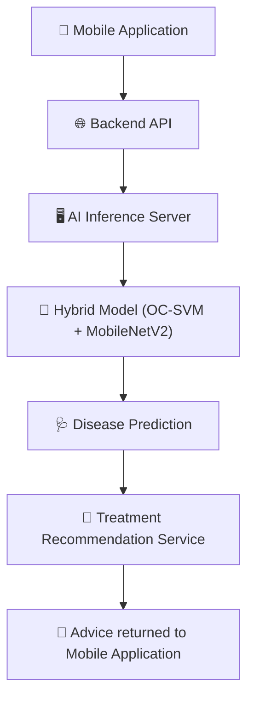

# System Architecture

This document describes the overall architecture of the **Deep Learning-Based Framework for Real-Time Detection and Classification of Lemon Plant Leaf Diseases**, an AI-powered platform designed for real-time detection of lemon plant diseases and automated treatment recommendation.

The system integrates **mobile computing, AI inference, backend APIs, and large language models** to provide a complete plant health monitoring solution.

---

# High-Level Architecture

The system consists of four primary components:

1. Mobile Application  
2. Backend API  
3. AI Inference Server  
4. Treatment Recommendation Service  

The interaction between these components forms the complete disease detection and advisory pipeline.

---

# Component Descriptions

## 1. Mobile Application

The mobile application provides the primary user interface for farmers and users.

Responsibilities:

- Capture plant leaf images using the smartphone camera
- Upload images to the backend API
- Display prediction results
- Display treatment recommendations

Technologies used:

- React Native
- Expo
- Redux
- TypeScript

The mobile app enables real-time interaction with the AI system and makes the solution accessible to non-technical users.

---

## 2. Backend API

The backend API acts as the central communication layer between the mobile application and the AI inference server.

Responsibilities:

- User authentication and management
- Image upload handling
- Storage of prediction results
- Communication with the AI inference server
- Forwarding prediction results to the treatment recommendation service

Technologies used:

- Node.js
- Express.js
- MongoDB
- Passport.js
- Multer
- Cloudinary

---

## 3. AI Inference Server

The AI inference server performs the core plant disease detection tasks using a hybrid machine learning pipeline.

The server is implemented using a Python-based web service.

Technologies used:

- Python
- Flask
- TensorFlow
- Scikit-learn

---

# Hybrid Disease Detection Model

The plant disease detection pipeline consists of two stages.

## Stage 1 — Novelty Detection

A **One-Class Support Vector Machine (OC-SVM)** is used to determine whether an input image belongs to the lemon leaf domain.

Purpose:

- Filter out non-lemon images
- Prevent misclassification of unrelated plant images

Feature extraction is performed using a **MobileNetV2 feature extractor**.

---

## Stage 2 — Disease Classification

Images that pass the novelty detection stage are forwarded to a **MobileNetV2-based Convolutional Neural Network**.

The CNN classifies the leaf image into one of three categories:

- Healthy Leaf
- Black Spot Disease
- Leaf Curl Disease

The trained model is optimized for efficient inference and mobile deployment.

---

# Treatment Recommendation Service

After disease classification, prediction results are sent to a recommendation service that generates actionable treatment guidance.

This component converts model outputs into human-readable advice.

Technologies used:

- FastAPI
- LangChain
- HuggingFace Inference API
- Mistral-7B-Instruct

---

# End-to-End Workflow

The following sequence illustrates the complete workflow of the system.

1. The user captures a lemon leaf image using the mobile application.
2. The image is uploaded to the backend API.
3. The backend forwards the image to the AI inference server.
4. The AI inference server performs novelty detection using OC-SVM.
5. Valid lemon leaf images are classified using the MobileNetV2 CNN.
6. The predicted disease class and confidence score are returned to the backend.
7. The backend forwards the prediction results to the treatment recommendation service.
8. The recommendation service generates treatment advice.
9. The final result and recommendation are returned to the mobile application.

---

# Repository Structure

The system is implemented across multiple repositories:

AI Inference Server  
Handles deep learning inference and disease classification.

Backend API  
Manages user accounts, image uploads, and system communication.

Mobile Application  
Provides the user interface for image capture and result visualization.

Treatment Recommendation Service  
Generates treatment advice using large language models.

The current repository serves as the **master research artifact repository** linking all system components.
